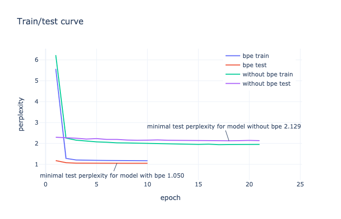

# tinkoff_nlp

Содержание
=================

<!--ts-->
   * [Результаты](#Вкратце)
     * [Анализ результатов](#анализ-результатов)
   * [Пайплайн](#Пайплайн)
   * [Инструкция](#Инструкция)
     * [Обучение](#Обучение)
     * [Валидация](#Валидация)
   
<!--te-->


 # Вкратце
 
 Я обучил маленькую языковую модель на основе stacked multi head self-attention то есть два слоя feed forward, затем attention, и потом нормализация;  архитектуру можно выбрать (см [здесь](#Обучение)).
 
 
 
 Сразу результаты:
 
 
 
 Только `bpe`:
 
 
 
 Я запускал три раза с разными `random seed` (кстати, даже при одном и том же `random seed` результаты немного отличаются)
 
 # Анализ результатов
 
В изначальном словаре было около 20000 слов. Для BPE я поставил ограничение в 5000 подслов.
Однако, сравнивать perplexity в одной и той же шкале не совсем верно. Ведь для первого случая нужно угадать слово, а для второго — его часть.
Понятно, что по началу слова легче угадать его конец, да и за верный ответ для bpe нужно считать угадывание всех двух частей слова.
Ясно, что хотя бы из-за меньшего словаря сross-entropy упадет (меньше вариантов).

Об этом написано, например [здесь](https://www.aclweb.org/anthology/P16-1162.pdf).

Перейдем к части, когда мы добавили в текст ошибки. Чем мы можем объяснить, что при использовании bpe perplexity возрастает не так сильно?
Пусть в слове допущена ошибка, в таком случае модель bpe, которая ни разу не видела такого слова, присвоит токен `[UNKNOWN]`

 Интересно и другое. В какой-то момент ошибка начинает падать. Всего скорее модель просто часто выдает большую вероятность для токена
 `[UNKNOWN]` и угадывает, так как много слов, которые bpe никогда не видел.
 
 # Пайплайн
 
 Для препроцессинга я просто написал 30 регулярок для всяких сокращений. Вот отрывок: 
````
        x = re.sub('^ж[\s.]', ' женщина ', x)
        x = re.sub('[\s.]д[\s.]', ' девушка ', x)
        x = re.sub('[\s.]дев[\s.]', ' девушка ', x)
        x = re.sub('[\s.]поз[\s.]', ' познакомится ', x)
````
 А так же для препроцессинга телефонных номеров и возраста, помечая их особыми токенами.
 
 После этого, если необходимо, я обучаю bpe (не в ридере! [здесь](https://github.com/allenai/allennlp/issues/1570) написано почему).
 Затем, в ридере, я просто подгружаю модель и токенезирую. Разбиение на train/test так же происходит при препроцессинге.
 
 Обучаю модель на этих данных. В файле `mistakes_validation.py` я так же подгружаю уже готовую `bpe` модель и саму `LM`.
 Валидация происходит на test. При чтение с вероятностью `mistakes_rate` вместо буквы подставляется случчайная, затем, если необходимо,
 мы пропускаем сообщение через `bpe`. После этого просто считаем perplexity.
 
 # Инструкция
 
 Я сделал парсер аргументов для обучения модели нужно запускать файл `main.py`, для валидации `mistakes_validation.py`
 
 Есть скрипт `run.sh`. Кнопка «» 
 
 # Обучение
 
 Список и краткое описание аргументов для `main.py`:
 - `--dataset-path` 
 
   **По умолчанию**
 
   `./`
 
   Путь до файла `data.csv`. В конце должно быть `/`. В ту же папку сохранится и `bpe` модель, а так же `train.csv` и 
   `test.csv`.
 
 - `--serialization-path`
 
   **По умолчанию**
 
   `./tb`
 
   Место, куда будет сохранена модель, логи tensorboard и vocabulary.
   
 - `--bpe`
 
   Использовать ли `bpe`. Если не указывать, то не используем.
 
 - `--epochs`
 
    **По умолчанию**
  
    `50`
 
   Количество максимального числа эпох обучения модели. `patience` для модели равен `3`.
 
 - `--batch`
 
    **По умолчанию**
  
    `8`
 
   Размер бэтча.
 
 - `--optimizer`
 
   **По умолчанию**
 
   `adam`
 
   Оптимиатор, который будет использоваться при обучении. Возможные варианты: `adam`, `radam`, `sgd`
 
 - `--learning-rate` `--lr`
 
    **По умолчанию**
  
    `1e-3`
  
    learning rate
  
  - `--arch`
  
    **По умолчанию**
  
    `stacked`

    Архитектура сети, которую мы будем обучать. Возможные варианты:
    
    - `lstm`
    
      ```torch.nn.LSTM(EMBEDDING_DIM, HIDDEN_DIM, batch_first=True, dropout=args.drop)```
   
    - `mhsa`
    
      ``MultiHeadSelfAttention(attention_dim=16, input_dim=EMBEDDING_DIM, num_heads=2,
                                     values_dim=16, attention_dropout_prob=args.drop)``
                                     
    - `stacked`
    
      ``StackedSelfAttentionEncoder(input_dim=EMBEDDING_DIM, hidden_dim=HIDDEN_DIM, num_layers=2,
                                                  projection_dim=16, feedforward_hidden_dim=16, num_attention_heads=2,
                                                  attention_dropout_prob=args.drop)``
                                                  
 - `--beta1`, `--beta2`
 
   **По умолчанию**
   
   `0.9`, `0.999`
   
   Параметры для `adam` или `radam`
   
 - `--momentum`
 
   **По умолчанию**
   
   `0.9`
   
   Параметр для `sgd`
   
 - `--drop` `--dropout`
 
   **По умолчанию**
   
   `0.1`
   
   Вероятность `dropout`-а
   
 - `--manualSeed`
 
   Можно задать `random seed`
   
 - `--gpu-id`
   
   **По умолчанию**
   
   `0`
   
   `gpu id` на котором будет обучаться модель
   
   
 # Валидация
 Список и краткое описание аргументов для `mistakes_rate.py`:
 
 - `--bpe`
 
   Использовалось ли при обучении `bpe`. Если да, то нужно указать `--bpe-path`
   
 - `--dataset-path`
 
   Путь до датасета. В этой папке должен лежать файл `test_data.csv`. К нему будут применены опечатки. Сам файл должен быть (так предполагается) без ошибок.
   
 - `--mistakes-rate`
    
    **По умолчанию**
   
    `0.01`
   
    Вероятность ошибки для каждого символа.
    
 - `--vacabulary-path`
 
   Путь, куда был сохранен словарь (объект `Vacabulary`). По умолчанию при обучении этот путь `serialization_path`+`/vocabulary`.
 
 
 - `--arch`
 
   Архитектура модели. Аналогично `main.py`.
   
 - `--bpe-path`
 
   Путь до предобученной модели `bpe`.
   
 - `--file`
 
   Можно указать в какой файл записать perplexity. Файл будет открыт с флагом `'a'`.