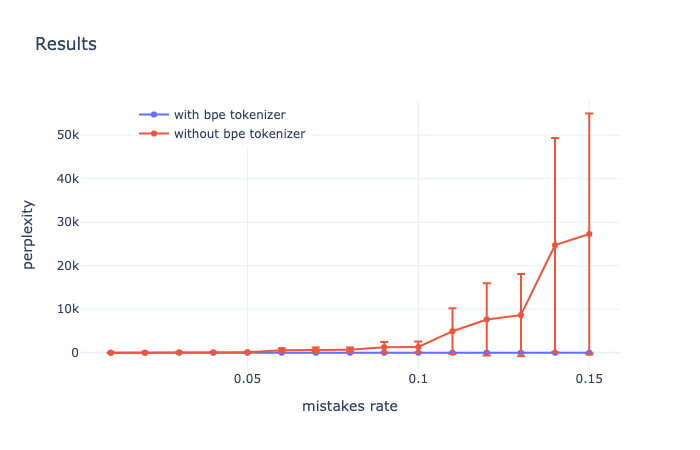
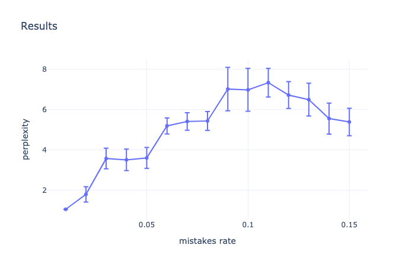

# tinkoff_nlp
 ## Вкратце
 
 Я обучил маленькую языковую модель из multi head self-attention (архитектуру можно выбрать).
 
 Сразу результаты:
 
 
 
 Только `bpe`:
 
 
 ## Инструкция
 
 Я сделал парсер аргументов для обучения модели нужно запускать файл `main.py`, для валидации `mistakes_validation.py`
 
 ### Обучение
 
 Список и краткое описание аргументов для `main.py`:
 - `--dataset-path` 
 
   **По умолчанию**
 
   `./`
 
   Путь до файла `data.csv`. В конце должно быть `/`. В ту же папку сохранится и `bpe` модель, а так же `train.csv` и 
   `test.csv`.
 
 - `--serialization-path`
 
   **По умолчанию**
 
   `./tb`
 
   Место, куда будет сохранена модель, логи tensorboard и vocabulary.
   
 - `--bpe`
 
   Использовать ли `bpe`. Если не указывать, то не используем.
 
 - `--epochs`
 
    **По умолчанию**
  
    `50`
 
   Количество максимального числа эпох обучения модели. `patience` для модели равен `3`.
 
 - `--batch`
 
    **По умолчанию**
  
    `8`
 
   Размер бэтча.
 
 - `--optimizer`
 
   **По умолчанию**
 
   `adam`
 
   Оптимиатор, который будет использоваться при обучении. Возможные варианты: `adam`, `radam`, `sgd`
 
 - `--learning-rate` `--lr`
 
  **По умолчанию**
  
  `1e-3`
  
  learning rate
  
  - `--arch`
  
    **По умолчанию**
  
    `stacked`

    Архитектура сети, которую мы будем обучать. Возможные варианты:
    
    - `lstm`
    
      ```torch.nn.LSTM(EMBEDDING_DIM, HIDDEN_DIM, batch_first=True, dropout=args.drop)```
   
    - `mhsa`
    
      ``MultiHeadSelfAttention(attention_dim=16, input_dim=EMBEDDING_DIM, num_heads=2,
                                     values_dim=16, attention_dropout_prob=args.drop)``
                                     
    - `stacked`
    
      ``StackedSelfAttentionEncoder(input_dim=EMBEDDING_DIM, hidden_dim=HIDDEN_DIM, num_layers=2,
                                                  projection_dim=16, feedforward_hidden_dim=16, num_attention_heads=2,
                                                  attention_dropout_prob=args.drop)``
                                                  
 - `--beta1`, `--beta2`
 
   **По умолчанию**
   
   `0.9`, `0.999`
   
   Параметры для `adam` или `radam`
   
 - `--momentum`
 
   **По умолчанию**
   
   `0.9`
   
   Параметр для `sgd`
   
 - `--drop` `--dropout`
 
   **По умолчанию**
   
   `0.1`
   
   Вероятность `dropout`-а
   
 - `--manualSeed`
 
   Можно задать `random seed`
   
 - `--gpu-id`
   
   **По умолчанию**
   
   `0`
   
   `gpu id` на котором будет обучаться модель
   
   
 ### Валидация
 Список и краткое описание аргументов для `mistakes_rate.py`:
 
 - `--bpe`
 
   Использовалось ли при обучении `bpe`. Если да, то нужно указать `--bpe-path`
   
 - `--path`
 
   Путь до датасета. В этой папке должен лежать файл `test_data.csv`. К нему будут применены опечатки. Сам файл должен быть (так предполагается) без ошибок.
   
 - `--mistakes-rate`
    
    **По умолчанию**
   
    `0.01`
   
    Вероятность ошибки для каждого символа.
    
 - `--vacabulary-path`
 
   Путь, куда был сохранен словарь (объект `Vacabulary`). По умолчанию при обучении этот путь `serialization_path`+`/vocabulary`.
 